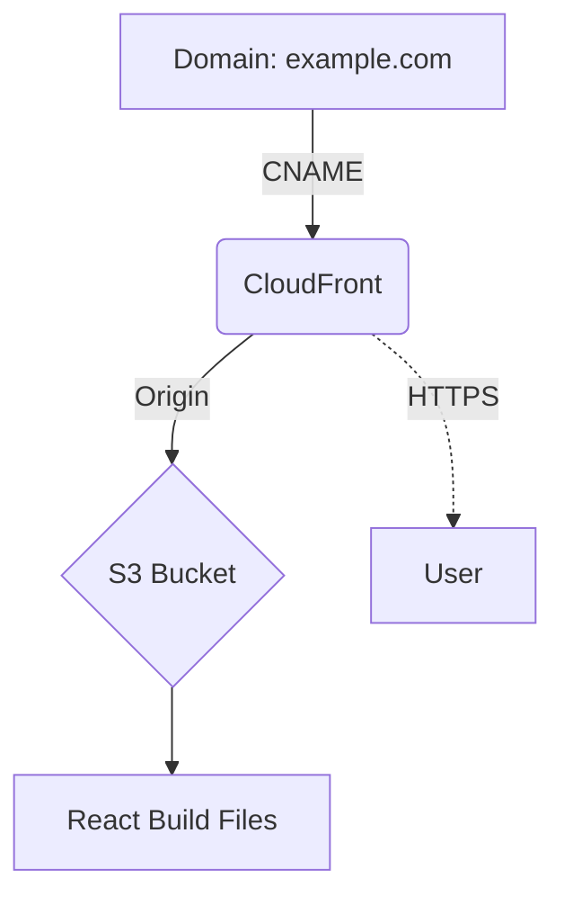

# Domain point to Website

To point your Hostinger-purchased domain to your React app server, follow these steps. I'll cover common hosting scenarios (AWS S3, EC2, CloudFront) and provide a **step-by-step guide** with DNS configuration examples.

---

### **Step 1: Determine Your React App Hosting**
First, identify where your React app is deployed:
- **AWS S3** (Static Hosting)  
- **AWS EC2** (Virtual Server)  
- **AWS CloudFront** (CDN + S3)  
- **Other (e.g., Netlify, Vercel)**

---

### **Step 2: Configure DNS Records in Hostinger**
1. **Log in to Hostinger** → **Domains** → **Manage DNS**.
2. Update DNS records based on your hosting:

#### **A. If Hosted on AWS S3 (Static Website)**
   - **Requirement**: S3 bucket name must match your domain (e.g., `www.example.com`).
   - **Hostinger DNS Setup**:
     | Type  | Name       | Value/Redirect Target                   | TTL     |
     |-------|------------|----------------------------------------|---------|
     | CNAME | `www`      | `<bucket-name>.s3-website-<region>.amazonaws.com` | 1 hour |
     | URL   | `@` (root) | `https://www.example.com`              | 301     |

   > ⚠️ **Limitation**: S3 doesn’t support root domains (`example.com`). Redirect root → `www` using Hostinger’s "URL Redirect" rule.

#### **B. If Hosted on AWS EC2**
   - **Requirement**: EC2 has a **public IPv4** or **Elastic IP**.
   - **Hostinger DNS Setup**:
     | Type | Name       | Value               | TTL     |
     |------|------------|---------------------|---------|
     | A    | `@` (root) | `EC2_Public_IP`     | 1 hour |
     | CNAME| `www`      | `example.com`       | 1 hour |

   > 🔐 **Tip**: Use an **Elastic IP** to avoid changes if your EC2 restarts.

#### **C. If Hosted on AWS CloudFront (Recommended)**
   - **Requirement**: CloudFront distribution + SSL certificate.
   - **Hostinger DNS Setup**:
     | Type | Name       | Value                     | TTL     |
     |------|------------|---------------------------|---------|
     | CNAME| `www`      | `d123.cloudfront.net`     | 1 hour |
     | CNAME| `@` (root) | `d123.cloudfront.net`     | 1 hour |

   > ✅ **Best Practice**: CloudFront supports root domains, HTTPS, and global caching.

---

### **Step 3: Verify AWS Configuration**
#### **For S3/CloudFront**:
1. **S3 Bucket Permissions**:
   - Enable **Static Website Hosting** in S3.
   - Bucket policy allowing public read access:
     ```json
     {
       "Version": "2012-10-17",
       "Statement": [{
         "Sid": "PublicRead",
         "Effect": "Allow",
         "Principal": "*",
         "Action": "s3:GetObject",
         "Resource": "arn:aws:s3:::YOUR_BUCKET_NAME/*"
       }]
     }
     ```
2. **CloudFront Setup**:
   - Origin: S3 bucket endpoint.
   - Alternate domain names: `example.com`, `www.example.com`.
   - SSL Certificate: Request via AWS ACM (us-east-1).

#### **For EC2**:
1. Ensure your React server (e.g., NGINX, Apache) runs on port 80/443.
2. Configure **Security Groups** to allow HTTP/HTTPS traffic.

---

### **Step 4: Enable HTTPS (Critical for React Apps)**
- **Hostinger Solution**: Use **SSL** → "Auto Redirect to HTTPS" in Hostinger’s dashboard.
- **AWS Solution**:
  - CloudFront: Use AWS ACM for free SSL.
  - EC2: Install Let’s Encrypt or use AWS Load Balancer + ACM.

---

### **Step 5: Test DNS Propagation**
1. Use tools like [DNS Checker](https://dnschecker.org/) to verify global DNS updates.
2. Wait 24-48 hours for full propagation.

---

### **Troubleshooting Common Issues**
| Issue                          | Solution                                  |
|--------------------------------|-------------------------------------------|
| **S3 root domain not working** | Redirect root → `www` via Hostinger URL Redirect. |
| **Mixed HTTPS/HTTP content**   | Ensure React app uses relative paths for assets. |
| **CloudFront 403 errors**      | Grant CloudFront OAI access to S3 bucket. |
| **EC2 timeout**                | Check Security Groups & NACLs allow HTTP/HTTPS. |

---

### **Recommended Architecture**


### **Why This Works**
1. **CloudFront**: Global CDN, DDoS protection, free SSL.
2. **S3**: Cheap storage, high durability.
3. **Hostinger DNS**: Simple CNAME management.

---

### **Final Checklist**
1. [ ] DNS records configured in Hostinger.
2. [ ] S3 bucket public access enabled (if applicable).
3. [ ] CloudFront alternate domains + SSL configured.
4. [ ] EC2 Security Groups open to HTTP/HTTPS.
5. [ ] HTTPS redirect enforced.

By following these steps, your React app will be accessible via your Hostinger domain with optimal performance and security.